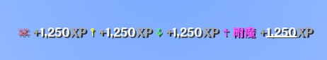

## 技能玩法
本服务器添加了技能玩法，玩家可以使用经验和知识点亮自己的技能，每种技能都有特定功能。

### 技能
游戏中共有21类技能，每类技能又含有若干种技能，技能又有与之对应的等级。每种技能都需要与之对应的经验进行点亮，除初始技能以外的技能都需要[能力](#能力)来解锁。哦

::: details 所有类别
经验分为以下21类
| 名称                   | 描述                                                         |
| ---------------------- | ------------------------------------------------------------ |
| [敏捷](agility.md)     | 敏捷可以在遇到障碍时帮助你快速、灵活的移动。                 |
| [建筑师](architect.md) | 结构是万物之本。现实在你手中，由你掌控。                     |
| [斧技](axes.md)        | 如果说你可以砍掉什么东西，以替代砍树，有什么不一样的吗？     |
| [防御](blocking.md)    | 棍棒与石头不会折断你的骨头，但是盾牌会。                     |
| [酿造](brewing.md)     | 咕嘟，咕嘟，咕嘟- 我依然不敢把这瓶药水丢进炼药锅中。         |
| [合成](crafting.md)    | 若没有剩下什么东西可以合成，为什么不再做一个呢？             |
| [探索](discovery.md)   | 当洞察力提升时，你的思维便会愈发澄澈，探索更多的奥秘。       |
| [附魔](enchanting.md)  | 你在嘀咕些什么？预言，幻象，还是在胡言乱语？                 |
| [挖掘](excavation.md)  | 挖大洞......                                                 |
| [草药学](herbalism.md) | 我见不到植物，不过我能找到一些种子还有- 呃......那是杂草吗？ |
| [狩猎](hunter.md)      | 狩猎是一段旅程，而不是结果。                                 |
| [下界](nether.md)      | 它自深处而来。                                               |
| [采矿](pickaxe.md)     | 矮人是矿工，而我在这段时间里明白了一件事。我是瑞典人！       |
| [箭术](ranged.md)      | 你与目标的距离是胜利的关键所在，也是生存的关键所在。         |
| [裂痕](rift.md)        | 裂痕如同一道尖锐的线束，此时你已控制了它。                   |
| [激流](seaborne.md)    | 带着它吧，也许有一天你会见到由水组成的奇观。                 |
| [隐形](stealth.md)     | 当行走于阴影里，这是隐藏于阴影中的艺术。                     |
| [剑术](swords.md)      | 来自玄武石的力量！                                           |
| [驯兽](taming.md)      | 鹦鹉、蜜蜂，还有......你？                                   |
| [塔格奥](tragoul.md)   | 血液在宇宙的血管中游动，束缚于你的手中。                     |
| [搏击](unarmed.md)     | 赤手空拳并不意味着失去力量。                                 |
:::

### 经验
在游戏里完成特定操作可获得经验（XP），获得的经验回在副标题栏显示。
ee

### 知识
当某种经验累计到一定等级后即可升级，一级就是一知识。知识可用来点亮技能。

### 能力
每点亮一个技能可即可获得一定的能力，各类技能之间的能力不互通。当总能力到达一定数值后即可解锁新的能力类别。

### 所有类别技能经验获取
| 名称                   | 获取途径                                                        |
| ---------------------- | ------------------------------------------------------------ |
| [敏捷](agility.md)     | 在任意维度移动，飞行，潜行，疾跑。                 |
| [建筑师](architect.md) | 在任意维度放置方块。                     |
| [斧技](axes.md)        | 用斧头攻击生物或用斧头破坏方块，如：树林等。    |
| [防御](blocking.md)    | 使用盾牌格挡攻击。                     |
| [酿造](brewing.md)     | 酿造，使用药水。         |
| [合成](crafting.md)    | 使用工作台合成物品。             |
| [探索](discovery.md)   | 在任意维度做出任何行为都有概率获得。       |
| [附魔](enchanting.md)  | 使用附魔台附魔装备，武器，工具。                 |
| [挖掘](excavation.md)  | 使用工具挖掘方块。                                                |
| [草药学](herbalism.md) | 吃食物，耕地。 |
| [狩猎](hunter.md)      | 击杀任意生物。                                 |
| [下界](nether.md)      | 击杀与下界有关的生物。                                               |
| [采矿](pickaxe.md)     | 挖掘矿物。       |
| [箭术](ranged.md)      | 使用弓箭攻击，击杀生物。         |
| [裂痕](rift.md)        | 使用与末地有关的物品（如：末影珍珠等）以及击杀末影生物。                   |
| [激流](seaborne.md)    | 在水中呆着，游泳。                |
| [隐形](stealth.md)     | 潜行状态下移动。                     |
| [剑术](swords.md)      | 使用剑攻击，击杀生物。                                           |
| [驯兽](taming.md)      | 驯服，繁殖，治疗生物。                                   |
| [塔格奥](tragoul.md)   | 被生物攻击在没有护盾的情况下。                     |
| [搏击](unarmed.md)     | 空手攻击，击杀生物。                                 |