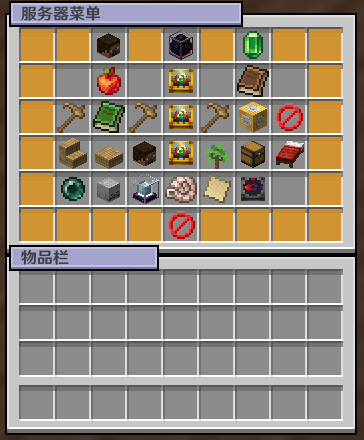

## 菜单使用
使用`/menu`命令即可打开菜单。

如果你很懒可以在主城购买[物品菜单](shop.md)，物品菜单右键即可打开，方便快捷。

打开菜单后即可看见如下界面：

### 总览
玩家：显示你的游戏名。点击可打开称号界面，关于称号详见[称号](title.md)

余额：显示你的余额，详见[经济系统](economy.md)。
### 子菜单
我的技能：详见[技能](/ability/README.md)。

每日任务：点击打开每日任务界面，完成任务后可得指定奖励。

### 领地系统
详见[领地](residence.md)。

---
### 杂项
#### 坐下
左键点击坐下，右键点击躺下。
#### 右键坐在其他玩家头上
开启后，右键其他玩家即可坐在他人头上。
#### 更新皮肤
点击刷新皮肤，如仍然无反应请稍后重试。离线玩家自定义皮肤见[用户中心](center.md)。
#### 连锁砍树
开启后使用斧头砍树即可自动连锁。
#### 自动整理
开启后在任意容器界面（如箱子）或背包空白格处双击即可自动整理箱子。
#### 家
左键点击可回家，右键点击在此处设置家。
#### 随机传送
点击随机传送至野外，**20元一次**。
#### 自杀
点击自杀。
#### 传送锚点
点击查看可用的传送锚点
#### 子服列表
点击查看子服列表，目前未开放任何子服。
#### 帮助文档
点击前往查看[此Wiki](/README.md)。
#### 前往主城
点击传送至主城。
#### 关闭页面
关闭菜单界面。