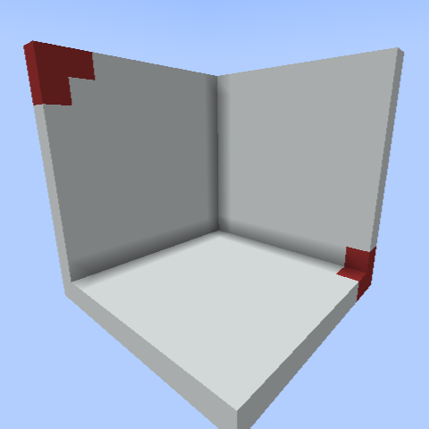

## 领地系统
本服务器添加了领地系统，玩家可自由用钱进行圈地。
### 创建领地
使用**木锄**对着你想进行保护的领地的对角方块左/右键。

副标题栏会提示选取的价格，并且会有粒子效果显示选取边框。

使用`/res create <领地名称>`即可创建自己的领地。
### 显示自己领地的边界
在菜单点击显示边界即可查看已创建领地的边界。

### 扩张、缩小自己的领地
站在领地内，对着你想扩张的方向打开菜单，点击扩张领地/缩小领地即可。

### 管理他人在自己领地的权限
站在领地内，打开菜单，点击管理领地权限即可。

### 删除领地
站着领地内，打开菜单，点击删除领地即可，**慎重使用，领地删除后只会返还部分创建时使用的钱**。
