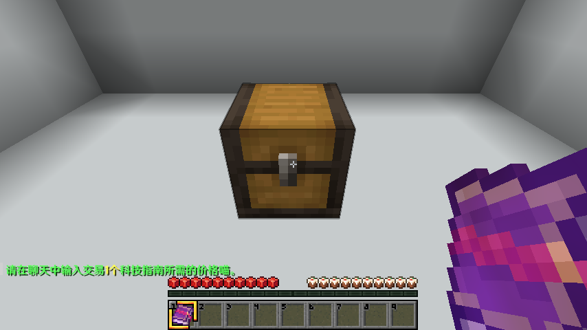
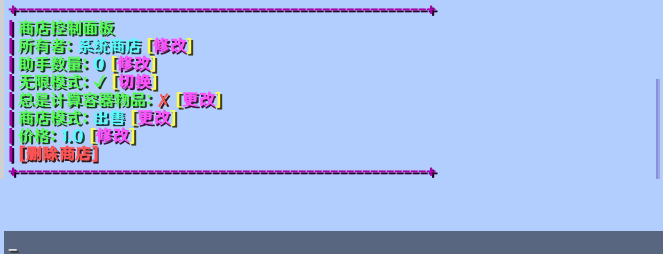
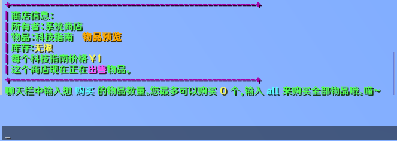

## 商店系统
本服务器添加了商店系统，玩家可自由创建收/售商店，并使用钱交易。

## 创建自己的商店
手持你想要交易的物品，左键箱子/大箱子/木桶。

在聊天栏输入你希望的价格即可。

::: tip
玩家创建的出售商店默认使用的是箱子内的货物，如果缺货请及时补货。
:::
#### 修改商店参数
右键点击创建的商店即可打开控制面板。

### 所有者
商店的所有者，点击可修改。
### 助手
帮助管理商店的玩家，点击可修改。
### 商店模式
商店的模式，出售或者收购，点击可切换。
### 价格
出售/收购的价格，点击可修改。
### 删除商店
点击可删除商店。
## 在他人商店购买/出售
左键键他人商店的告示牌输入你想购买的数量即可，对于主城的系统商店系统商店也是同理。购买后钱会自动从你的账户扣除。

### 物品预览
点击即可预览商店所售卖的物品，在查看物品的属性时十分有用。